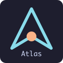
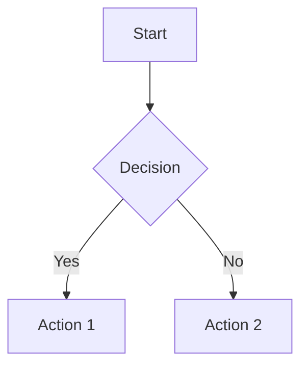

# ProjectAtlas

<div align="center">
  
  
  <h3>The Ultimate Workspace Navigator</h3>
  
  **Unified, offline workspace atlas for VS Code — documents, diagrams, workflows, directories, symbols & call graphs in one interactive panel.**
  
  <p align="center">
    <a href="https://marketplace.visualstudio.com/items?itemName=MantejSingh.projectatlas">
      
    </a>
    <a href="https://marketplace.visualstudio.com/items?itemName=MantejSingh.projectatlas">
      
    </a>
    <a href="https://marketplace.visualstudio.com/items?itemName=MantejSingh.projectatlas">
      
    </a>
    <a href="https://github.com/Drago-03/ProjectAtlas/actions/workflows/ci.yml">
      
    </a>
  </p>
  
  <p align="center">
    
    
    
    
  </p>
</div>

---

## What is ProjectAtlas?

ProjectAtlas transforms your VS Code into a **powerful workspace navigator** that consolidates multiple tools into one seamless experience. No more juggling between different extensions for documentation, diagrams, and code analysis!

<div align="center">
  <picture>
    <source media="(prefers-color-scheme: dark)" srcset="https://via.placeholder.com/800x400/1a1a1a/ffffff?text=Dark+Mode+Preview">
    
  </picture>
</div>

## Key Features

<table>
<tr>
<td>

### **Smart Documentation**
- **Markdown** rendering with syntax highlighting
- **Live Mermaid** diagram support
- **GitHub Actions** workflow visualization
- Real-time preview with theme sync

</td>
<td>

### **Interactive Graphs**
- **Directory trees** with click-to-navigate
- **Symbol extraction** for TypeScript/JavaScript
- **Call graphs** and dependency mapping
- Force-directed graph layouts

</td>
</tr>
<tr>
<td>

### **Performance First**
- **100% offline** - no network required
- **Incremental updates** via patch protocol
- **Lazy loading** for large codebases
- **Memory efficient** symbol caching

</td>
<td>

### **Developer Experience**
- **One-click access** via command palette
- **Automatic discovery** of project structure
- **Cross-platform** support (Windows, macOS, Linux)
- **Zero configuration** required

</td>
</tr>
</table>

## Quick Start

<div align="center">

### Installation

</div>

1. **Install from VS Code Marketplace**
   ```
   Ctrl+P → ext install MantejSingh.projectatlas
   ```

2. **Or install from Command Line**
   ```bash
   code --install-extension MantejSingh.projectatlas
   ```

3. **Launch ProjectAtlas**
   ```
   Ctrl+Shift+P → "ProjectAtlas: Open"
   ```

<div align="center">

**That's it!** ProjectAtlas will automatically analyze your workspace and present an interactive overview.

</div>

## Supported File Types & Features

<div align="center">

| **Content Type** | **Capability** | **Details** |
|:------------------:|:------------------:|:----------------|
| **Markdown** | Live Preview + Mermaid | Syntax highlighting, fenced code blocks, inline diagrams |
| **Mermaid** | Theme-aware Rendering | Flowcharts, sequence diagrams, automatic light/dark mode |
| **GitHub Actions** | Workflow Visualization | Job dependency graphs, YAML parsing, live monitoring |
| **TypeScript/JS** | Symbol Extraction | Functions, classes, imports, call graphs via ts-morph |
| **Directories** | Interactive Trees | Folder/file navigation, search filtering, click-to-open |
| **JSON/YAML** | Structure Analysis | Configuration files, workflow definitions, data validation |

</div>

## Usage Examples

### Visualize Your Codebase
```typescript
// ProjectAtlas automatically detects and maps:
export class DataProcessor {
  process(data: UserData): ProcessedData {
    return this.transform(data);
  }
}
// → Creates interactive symbol graph with call relationships
```

### GitHub Actions Workflows
```yaml
# .github/workflows/ci.yml
name: CI
on: [push, pull_request]
jobs:
  test:
    runs-on: ubuntu-latest
    # → Automatically visualized as dependency graph
```

### Live Mermaid Diagrams
````markdown

# → Renders immediately with theme sync
````

## Configuration

ProjectAtlas works out of the box, but you can customize it:

```json
{
  "projectAtlas.enableStatusBar": true,
  "projectAtlas.showWelcomeOnStartup": true
}
```

## Commands

| Command | Description | Shortcut |
|---------|-------------|----------|
| `ProjectAtlas: Open` | Launch the main panel | `Ctrl+Shift+P` |

**Pro Tip:** Add ProjectAtlas to your activity bar or create a custom keybinding for instant access!

## Architecture

<details>
<summary>**Technical Details**</summary>

ProjectAtlas uses a modern architecture:

- **Extension Host** (Node.js) - File watching, symbol extraction, VS Code API
- **Webview** (React + Vite) - Interactive UI, graph rendering, live updates
- **Message Bridge** - Type-safe communication between host and webview
- **Incremental Updates** - Patch-based system for performance

**Symbol Providers:**
- TypeScript/JavaScript: `ts-morph` AST parsing
- Future: Python, Go, Java, C# providers planned

</details>

## Requirements

- **VS Code** 1.85.0 or higher
- **Node.js** 18.x or 20.x (for development)
- **Operating System:** Windows, macOS, or Linux

## Themes & Customization

ProjectAtlas automatically adapts to your VS Code theme:

- **Light themes** → Clean, minimal interface
- **Dark themes** → Sleek, modern appearance
- **Custom themes** → Automatic color scheme detection

## Performance

<div align="center">

| Metric | Value | Description |
|:------:|:-----:|:------------|
| **Bundle Size** | ~10MB | All dependencies included (offline) |
| **Startup Time** | <2s | Cold start to interactive |
| **Memory Usage** | <50MB | Typical workspace analysis |
| **Update Speed** | <100ms | Incremental symbol updates |

</div>

## Changelog

### [0.2.3] - 2025-08-13
- Enhanced documentation and development workflow
- Improved VS Code workspace configuration
- Bug fixes and performance improvements
- Comprehensive setup guides and contribution documentation

<details>
<summary>**Previous Versions**</summary>

### [0.2.2] - 2025-08-13
- Documentation and security updates
- Version bump with stability improvements

### [0.2.1] - 2025-08-13
- Initial public release
- Python & Go provider stubs
- Search and filter functionality
- Status bar integration
- Activity bar view container
- Welcome walkthrough

</details>

## Contributing

We welcome contributions!

<div align="center">

**[Read the Contributing Guide](CONTRIBUTING.md)** | **[Basic Instructions](docs/basic_instructions.md)** | **[Architecture Docs](docs/architecture.md)**

</div>

### Quick Development Setup

```bash
git clone https://github.com/Drago-03/ProjectAtlas.git
cd ProjectAtlas
npm install && npm run build
# Press F5 in VS Code to launch Extension Development Host
```

## 📄 License

This project is licensed under the **MIT License** - see the [LICENSE](LICENSE) file for details.

---

<div align="center">

**Star us on GitHub** | **Report Issues** | **Request Features**

<sub>Made with ❤️ for the VS Code community</sub>

</div>

---
