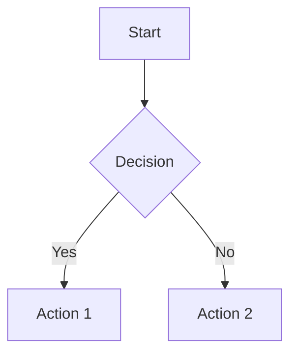

# ProjectAtlas

<div align="center">
  
  
  <h3>The Ultimate Workspace Navigator</h3>
  
  **Unified, offline workspace atlas for VS Code — documents, diagrams, workflows, directories, symbols & call graphs in one interactive panel.**
  
  <p align="center">
    <a href="https://marketplace.visualstudio.com/items?itemName=MantejSingh.projectatlas">
      
    </a>
    <a href="https://marketplace.visualstudio.com/items?itemName=MantejSingh.projectatlas">
      
    </a>
    <a href="https://marketplace.visualstudio.com/items?itemName=MantejSingh.projectatlas">
      
    </a>
    <a href="https://github.com/Drago-03/ProjectAtlas/actions/workflows/ci.yml">
      
    </a>
  </p>
  
  <p align="center">
    
    
    
    
  </p>
</div>

---

## What is ProjectAtlas?

ProjectAtlas transforms your VS Code into a **powerful workspace navigator** that consolidates multiple tools into one seamless experience. No more juggling between different extensions for documentation, diagrams, and code analysis!

## 🆕 What's New in v0.2.5!

<div align="center">

🔍 **Advanced Search** • 📊 **Data Export** • ⚡ **Auto-refresh** • 🎨 **Modern UI** • 📈 **Analytics Dashboard**

*The most comprehensive update yet - making ProjectAtlas more powerful and user-friendly than ever!*

</div>

## Key Features

<table>
<tr>
<td>

### **Smart Documentation**
- **Markdown** rendering with syntax highlighting
- **Live Mermaid** diagram support
- **GitHub Actions** workflow visualization
- Real-time preview with theme sync

</td>
<td>

### **Enhanced UI & Search** ⭐ *New in 0.2.5*
- **Advanced Search** with real-time filtering
- **Export functionality** (JSON/CSV formats)
- **Auto-refresh** with configurable intervals
- **Notification system** for user feedback
- **Keyboard shortcuts** for rapid navigation

</td>
</tr>
<tr>
<td>

### **Interactive Graphs**
- **Directory trees** with click-to-navigate
- **Symbol extraction** for TypeScript/JavaScript
- **Call graphs** and dependency mapping
- Force-directed graph layouts

</td>
<td>

### **Analytics & Metrics** ⭐ *New in 0.2.5*
- **Code quality metrics** across languages
- **Performance monitoring** with memory tracking
- **Dependency analysis** with visualization
- **Enhanced diagnostics** with severity levels
- **Multi-language support** for symbol analysis

</td>
</tr>
<tr>
<td>

### **Performance First**
- **100% offline** - no network required
- **Incremental updates** via patch protocol
- **Lazy loading** for large codebases
- **Memory efficient** symbol caching
- **Progressive loading** with status indicators

</td>
<td>

### **Developer Experience**
- **One-click access** via command palette
- **Automatic discovery** of project structure
- **Cross-platform** support (Windows, macOS, Linux)
- **Zero configuration** required
- **Modern design system** with animations

</td>
</tr>
</table>

## Quick Start

<div align="center">

### Installation

</div>

1. **Install from VS Code Marketplace**
   ```
   Ctrl+P → ext install MantejSingh.projectatlas
   ```

2. **Or install from Command Line**
   ```bash
   code --install-extension MantejSingh.projectatlas
   ```

3. **Launch ProjectAtlas**
   ```
   Ctrl+Shift+P → "ProjectAtlas: Open"
   ```

<div align="center">

**That's it!** ProjectAtlas will automatically analyze your workspace and present an interactive overview.

</div>

## Supported File Types & Features

<div align="center">

| **Content Type** | **Capability** | **Details** |
|:------------------:|:------------------:|:----------------|
| **Markdown** | Live Preview + Mermaid | Syntax highlighting, fenced code blocks, inline diagrams |
| **Mermaid** | Theme-aware Rendering | Flowcharts, sequence diagrams, automatic light/dark mode |
| **GitHub Actions** | Workflow Visualization | Job dependency graphs, YAML parsing, live monitoring |
| **TypeScript/JS** | Symbol Extraction | Functions, classes, imports, call graphs via ts-morph |
| **Python** | Symbol Analysis ⭐ *New* | Classes, functions, imports with enhanced metrics |
| **JSON/YAML** | Structure Analysis | Configuration files, workflow definitions, data validation |
| **Directories** | Interactive Trees | Folder/file navigation, search filtering, click-to-open |
| **All Files** | Search & Export ⭐ *New* | Real-time search, CSV/JSON export, analytics |

</div>

## Usage Examples

### Visualize Your Codebase
```typescript
// ProjectAtlas automatically detects and maps:
export class DataProcessor {
  process(data: UserData): ProcessedData {
    return this.transform(data);
  }
}
// → Creates interactive symbol graph with call relationships
```

### Advanced Search & Filtering ⭐ *New in 0.2.5*
```bash
# Search across your entire workspace:
"function getData"     # Find all functions containing "getData"
"*.test.ts"           # Filter to test files only
"TODO"                # Find all TODO comments
"import React"        # Locate React imports
```

### Export Your Data ⭐ *New in 0.2.5*
```javascript
// Export workspace analysis to JSON
{
  "files": 147,
  "symbols": 523,
  "dependencies": 34,
  "metrics": {
    "codeQuality": 8.7,
    "testCoverage": 85.2,
    "complexity": "low"
  }
}
// → Perfect for CI/CD integration and reporting
```

### GitHub Actions Workflows
```yaml
# .github/workflows/ci.yml
name: CI
on: [push, pull_request]
jobs:
  test:
    runs-on: ubuntu-latest
    # → Automatically visualized as dependency graph
```

### Live Mermaid Diagrams
````markdown

# → Renders immediately with theme sync
````

## Configuration

ProjectAtlas works out of the box, but you can customize it:

```json
{
  "projectAtlas.enableStatusBar": true,
  "projectAtlas.showWelcomeOnStartup": true,
  "projectAtlas.autoRefresh": true,
  "projectAtlas.refreshInterval": 30000,
  "projectAtlas.enableNotifications": true,
  "projectAtlas.exportFormat": "json"
}
```

### Configuration Options ⭐ *Enhanced in 0.2.5*

| **Setting** | **Default** | **Description** |
|:------------|:-----------:|:----------------|
| `enableStatusBar` | `true` | Show ProjectAtlas in status bar |
| `showWelcomeOnStartup` | `true` | Display welcome screen on first use |
| `autoRefresh` | `false` | Enable automatic data refresh ⭐ *New* |
| `refreshInterval` | `30000` | Auto-refresh interval in milliseconds ⭐ *New* |
| `enableNotifications` | `true` | Show status notifications ⭐ *New* |
| `exportFormat` | `"json"` | Default export format (json/csv) ⭐ *New* |

## Commands

| Command | Description | Shortcut |
|---------|-------------|----------|
| `ProjectAtlas: Open` | Launch the main panel | `Ctrl+Shift+P` |

## New in Version 0.2.5! 🎉

### 🔍 **Advanced Search & Filtering**
- **Real-time search** across all workspace data
- **Smart filtering** by file types, symbols, and content
- **Instant results** with highlight matching

### 📊 **Export & Analytics**
- **Export to JSON/CSV** for external analysis
- **Code metrics dashboard** with quality indicators
- **Performance monitoring** with memory and timing data
- **Dependency graphs** with interactive visualization

### ⚡ **Enhanced User Experience**
- **Auto-refresh functionality** with customizable intervals
- **Keyboard shortcuts** for power users:
  - `Ctrl/Cmd+R` - Refresh data
  - `Ctrl/Cmd+E` - Quick export
  - `Ctrl/Cmd+1-6` - Switch between tabs
- **Loading progress indicators** for better feedback
- **Notification system** for status updates
- **Modern design** with smooth animations

### 🎨 **UI Improvements**
- **Responsive design** that adapts to all screen sizes
- **Enhanced color scheme** with better contrast
- **Interactive elements** with hover effects
- **Status indicators** for real-time data freshness

**Pro Tip:** Add ProjectAtlas to your activity bar or create a custom keybinding for instant access!

## ⌨️ Keyboard Shortcuts ⭐ *New in 0.2.5*

ProjectAtlas now supports powerful keyboard shortcuts for enhanced productivity:

<div align="center">

| **Shortcut** | **Action** | **Description** |
|:------------:|:----------:|:----------------|
| `Ctrl/Cmd+R` | **Refresh** | Instantly refresh all workspace data |
| `Ctrl/Cmd+E` | **Export** | Quick export current view to JSON/CSV |
| `Ctrl/Cmd+F` | **Search** | Focus on search input for filtering |
| `Ctrl/Cmd+1` | **Overview** | Switch to overview tab |
| `Ctrl/Cmd+2` | **Analysis** | Switch to analysis tab |
| `Ctrl/Cmd+3` | **Performance** | Switch to performance tab |
| `Ctrl/Cmd+4` | **Diagnostics** | Switch to diagnostics tab |
| `Ctrl/Cmd+5` | **Dependencies** | Switch to dependencies tab |
| `Ctrl/Cmd+6` | **Export** | Switch to export tab |

</div>

**Tips:**
- Use `Ctrl+R` for quick data refresh without mouse clicks
- Combine `Ctrl+E` with tab switching for rapid exports
- `Ctrl+F` + search terms for lightning-fast filtering

## Architecture

<details>
<summary>**Technical Details**</summary>

ProjectAtlas uses a modern architecture:

- **Extension Host** (Node.js) - File watching, symbol extraction, VS Code API
- **Webview** (React + Vite) - Interactive UI, graph rendering, live updates
- **Message Bridge** - Type-safe communication between host and webview
- **Incremental Updates** - Patch-based system for performance

**Symbol Providers:**
- TypeScript/JavaScript: `ts-morph` AST parsing
- Future: Python, Go, Java, C# providers planned

</details>

## Requirements

- **VS Code** 1.85.0 or higher
- **Node.js** 18.x or 20.x (for development)
- **Operating System:** Windows, macOS, or Linux

## Themes & Customization

ProjectAtlas automatically adapts to your VS Code theme:

- **Light themes** → Clean, minimal interface
- **Dark themes** → Sleek, modern appearance
- **Custom themes** → Automatic color scheme detection

## Performance

<div align="center">

| Metric | Value | Description |
|:------:|:-----:|:------------|
| **Bundle Size** | ~10MB | All dependencies included (offline) |
| **Startup Time** | <2s | Cold start to interactive |
| **Memory Usage** | <50MB | Typical workspace analysis |
| **Update Speed** | <100ms | Incremental symbol updates |
| **Search Speed** | <50ms | Real-time filtering results ⭐ *New* |
| **Export Speed** | <1s | JSON/CSV generation ⭐ *New* |

</div>

## 📋 Changelog

For detailed release notes, version history, and feature updates, please see:

<div align="center">

**[� View Complete Changelog](CHANGELOG.md)**

*Stay updated with the latest features, improvements, and bug fixes*

</div>

## Contributing

We welcome contributions!

<div align="center">

**[Read the Contributing Guide](CONTRIBUTING.md)** | **[Basic Instructions](docs/basic_instructions.md)** | **[Architecture Docs](docs/architecture.md)**

</div>

### Quick Development Setup

```bash
git clone https://github.com/Drago-03/ProjectAtlas.git
cd ProjectAtlas
npm install && npm run build
# Press F5 in VS Code to launch Extension Development Host
```

## 📄 License

This project is licensed under the **MIT License** - see the [LICENSE](LICENSE) file for details.

---

<div align="center">

**Star us on GitHub** | **Report Issues** | **Request Features**

</div>

---
