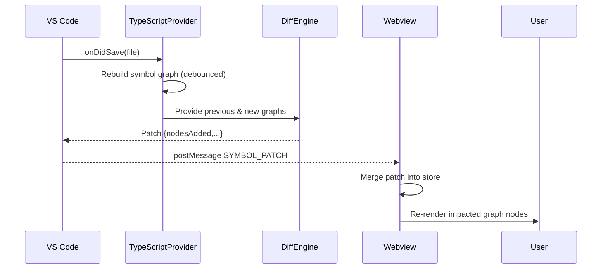

# ProjectAtlas Architecture

This document provides a systems-level view, data contracts, and runtime flows. Diagrams use Mermaid for clarity.

## Layered Overview

```mermaid
flowchart TB
	subgraph VSCode[VS Code Host]
		A[Activation Command\nprojectAtlas.open]
		W[File Watchers\n(onDidSave, Workflow YAML)]
		P[Symbol Providers\nts-morph]
		D[Diff Engine\n(diffGraphs)]
		C[Message Bridge]
	end
	subgraph Webview[Webview React SPA]
		S[State Store]
		R1[Markdown & Mermaid Renderer]
		R2[Directory Graph]
		R3[Workflow Graph]
		R4[Symbol Graph]
		Patch[Patch Merge]
	end
	FS[(Workspace FS)]
	YAML[(.github/workflows)]
	A --> FS
	W --> YAML
	FS --> P
	P --> D
	YAML --> P
	D -->|INIT_STATE / SYMBOL_PATCH| C --> S
	S --> Patch --> R4
	S --> R2
	S --> R3
	S --> R1
```

## Runtime Flow (Symbol Update)


## Data Contracts
```ts
interface GraphNode { id: string; label?: string; kind?: string; file?: string }
interface GraphEdge { id: string; from: string; to: string; kind: string }
interface SymbolGraph { nodes: GraphNode[]; edges: GraphEdge[]; diagnostics?: string[] }
interface SymbolGraphPatch {
	nodesAdded: GraphNode[];
	nodesRemoved: string[];
	edgesAdded: GraphEdge[];
	edgesRemoved: string[];
}
```

## Messaging Channel
| Message | Direction | Payload |
|---------|-----------|---------|
| INIT_STATE | Extension -> Webview | Initial graphs & markdown seed |
| SYMBOL_PATCH | Extension -> Webview | SymbolGraphPatch |
| WORKFLOW_UPDATE | Extension -> Webview | Recomputed workflow graph |
| RENDER_MERMAID | Webview -> Extension | Mermaid source block |
| MERMAID_RESULT / MERMAID_ERROR | Extension -> Webview | Rendered SVG or diagnostics |
| OPEN_FILE | Webview -> Extension | `{ file: string }` |

## Performance Strategies
* Debounce rebuild to collapse rapid save bursts.
* Diff-based patching to limit UI reconciliation to changed nodes/edges.
* Cached last workflow graph; no recompute if YAML unchanged.
* Lazy mermaid rendering; blocked if outside webview DOM.

## Security & Isolation
* Strict CSP: only local `vscode-resource` URIs.
* No network requests; offline-first.
* Sanitized markdown via `marked` + code highlighting; fenced mermaid isolated.

## Extensibility Roadmap
Future symbol providers will implement a shared interface producing `SymbolGraph`. A provider registry allows conditional activation per language setting.

## Future Enhancements (Design Notes)
* Graph clustering for large repos (community layout or hierarchical edge bundling).
* Virtualized node lists for search/filter results.
* Export service to transform current graph view into SVG/PNG (using DOM to SVG serialization).

